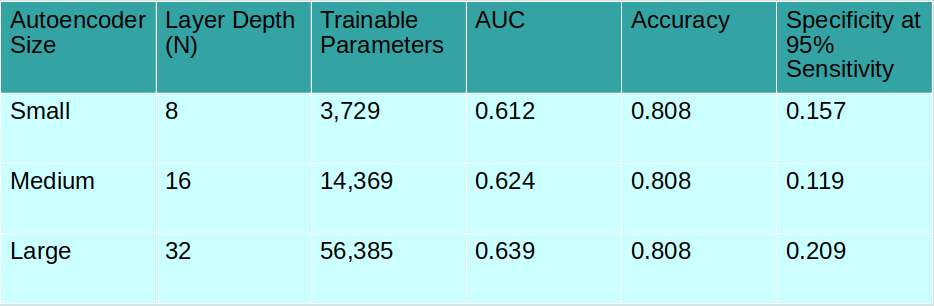

# Thyroid Nodule Autoencoder

### Abstract

Thyroid nodules are an extremely common occurrences in adults though only a small portion of these nodules are malignant.. Fine Needle Aspiration (FNA) biopsies are commonly performed to identify malignancy and there is a pressing need for reliable, non-invasive methods to reduce unnecessary FNA procedures. In this study, we explore different architectures of one class autoencoders as a means to make this classification from a dataset of 964 Shear Wave Elastography and B-mode ultrasound images. The different autoencoders were constructed with varying numbers of layers and layer depths and were trained to encode and reconstruct images of benign nodules only. The intention is that images of benign nodules will have a lower reconstruction error than malignant nodules. This reconstruction error can then be used as the test statistic to classify images. The success of each autoencoder was evaluated using the area under a curve (AUC) and accuracy of classification.  The highest AUC achieved was 0.872, with an accuracy of 88.2% for the determination of malignancy. This study demonstrates that autoencoders offer a viable approach for thyroid nodule classification on ultrasound images.  

### Introduction
Thyroid nodules, are solid fluid filled growths that are extremely common. There are many different causes of thyroid nodules, and they are very rarely serious. However, thyroid nodules do have the potential to be cancerous. Currently, the main method of testing the nodules is a fine needle aspiration biopsy. In this procedure, a needle will be instered into the paitents thyroid using ultrasound guidance. The needle will then collect samples of cells from the thyroid to be tested. This is usually repeated 2-6 times to increase the liklihood that any cancerous cells will be found. This procedure, while relatively simple, is quite painful for the patient, and consumes hospital resources. Given the commonality of thyroid nodules, and the rarity that they are cancerous, there is demand for an effient, reliable, and non-invasive alternative that could potentially reccomend patients with particularly suspicious nodules for an FNA biopsy, while filtering out patients with benign nodules. This would help mitigate the amount of unneccesary FNA procedures, therefore saving hospital resources and patients' necks. Machine learning algorithms offer a variety of approaches to build a tool to make thyroid nodule classifications. One such approach is to use an autoencoder.

### Methods

In this study, an autoencoder was chosen as the method of classification. An autoencoder is a type of neural network designed for encoding and compressing images, and then decoding and reconstructing them. The autoencoder recieved a training dataset of images, then using convolutional layers it distinguished important features of images. Using a max pooling technique, the autoencoder simultaneously downsamples the images. Once the images are encoded and downsampled, they are then reconstructed and decoded with the goal of being as close to the original image as possible. Any differences between the input and output images can be considered reconstruction error. To quantify this, the mean squared error is calculated. The autoencoder will change weights within the convolutional layers to minimize mean squared error each time it runs, until it is unable to decrease it any further.

The autoencoders in this study were trained using only benign images. The intention behind limiting its training is that the autoencoder will be able to reconstruct images of benign nodules more successfully than malignant nodule images. This therefore allows the mean squared error to become a classification variable, where anything above a certain mean sqaured error will be classified malignant, and anything below will be classified as benign.

### Results

The metrics used to evaluate the performances of each autoencoder were the area under a ROC curve (AUC), the accuracy, and the specificity at 95% sensitivity. The autoencoders originally performed quite well on a very small test set of images achieving the scores discussed in the abstract. However, upon increasing the size of the test set, it was revealed the autoencoders actually performed quite poorly, acheiving AUC scores in the range 0.61-0.64, accuracies of 0.808, and specificities in between 0.11 and 0.21. The scores are summarized in the table below.

The graph below is a histogram for each of the three autoencoders with the mean squared errors for each image tested. It clearly shows there is little to no distinction between the two populations.

The figure below is the ROC curves generated for each of the autoencoders. An ideal ROC curve is as close to the upper left corner as possible (Maximize true positives, minimize false positives). 

### Discussions

Although the autoencoder was initially promising, after expanding the test dataset it was discovered that it hardly performed better than guessing. Overall, it's safe to say the future of autoencoders as thyroid classifciation tools seems bleak. Some ways the performance of the autoencoder might improve would be to use a larger training dataset of benign images, or use data augmentation to increase the amount of knowledge the autoencoder could gain from the current dataset. Further, the autoencoder seemed to struggle with the recreation of images with very high pixel values. This resulted in these types of images having the largest mean squared error of all, regardless of malignancy. It is possible that with an alternative metric to analyze reconstruction error there may be an increase in performance.
